# Алгоритмы тренировка

## Задача: реализовать очередь и стек на массивах и на списках.

Необходимо реализовать функции добавления и извлечения элемента.
Представитм абстракции стека и очереди как структур данных:

## Решение

### Вашему вниманию предлагается графическое представление задачи:
|абстракция|детали абстракции|
|----------|-----------------|
|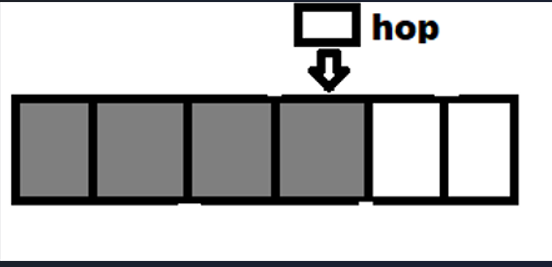|hop - указатель на последний добавленный элемент|
|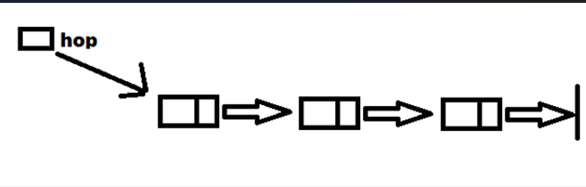|hop - указатель на последний добавленный элемент|
|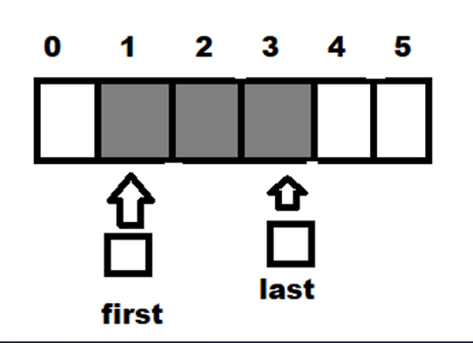|first - указатель на первый вошедший в очередь элемент, last - указатель на последний вошедший элемент|
|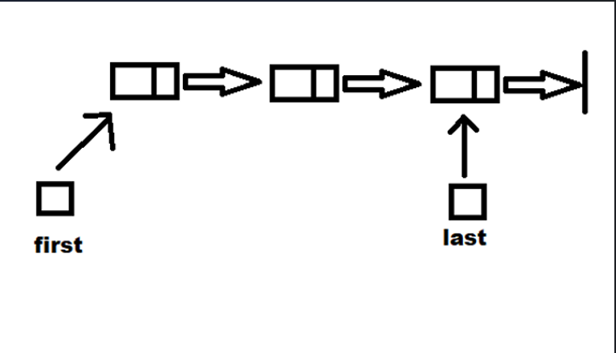|first - указатель на первый вошедший в очередь элемент, last - указатель на последний вошедший элемент|

### Пограничные случаи
Рассмотрим пограничные случая для каждого из представленных выше абстракций

|абстракция|картинка|пограничные случаи на добавление и удаление элементов|
|----------|--------|------------------|
|Стек на массивах||<ol><li>В стеке нет элементов. **Проблема добавления**: указатель hop указывает в пустоту. **Проблема извлечения**: нечего извлекать из пустоты.</li> <li>Массив заполнен полностью. **Проблема добавления**: нет места для добавления.</li></ol>|
|Стек на списках||---|
|Очередь на массивах||<ol><li>В очереди нет элементов. **Проблема добавления**: указатель fist указывает в пустоту. **Проблема извлечения**: нечего извлекать из очереди.</li><li>Массив заполнен полностью. **Проблема добавления**: нет свободного места для нового элемента.</li><li>Необходимость "зациклить" память массива.</li></ol>|
|Очередь на списках||-----|

### Реализация на языке C++
Реализовано спомощью структур
|структура данных|поля структуры|функция добавления|функция извлечения|
|----------------|--------------|------------------|------------------|
|стек на массивах|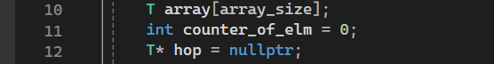|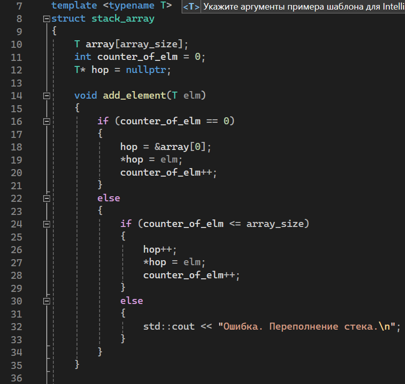|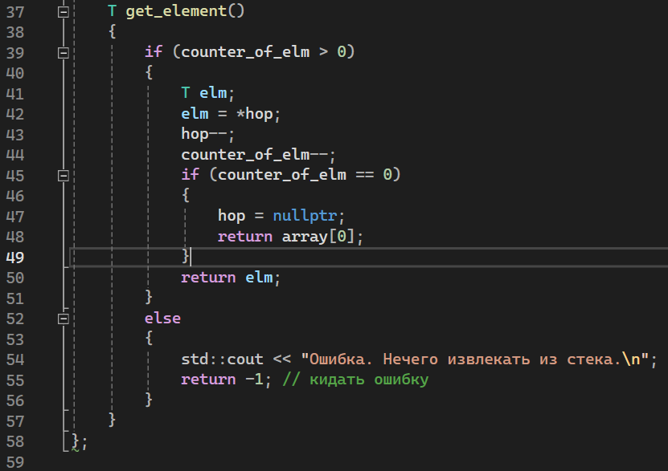|
|стек на списках|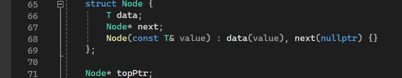|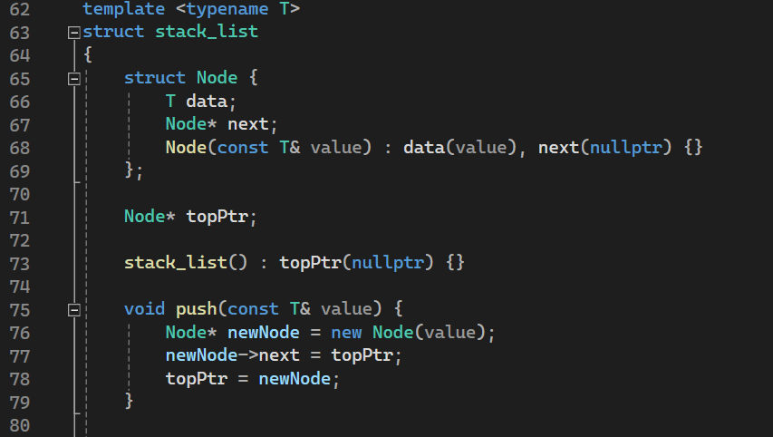|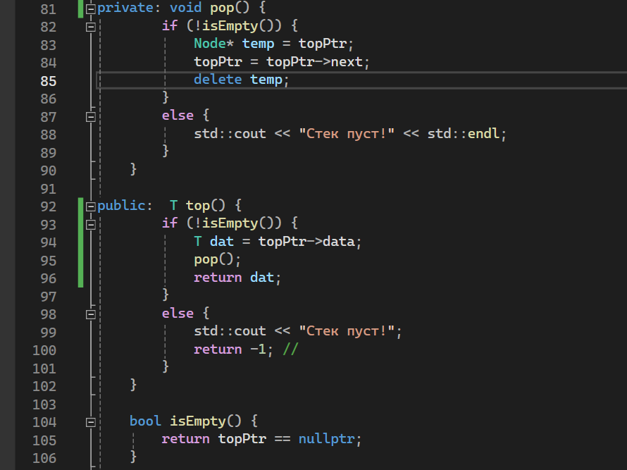|
|очередь на массивах|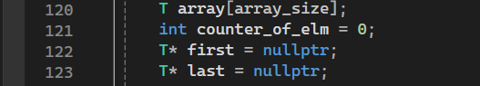|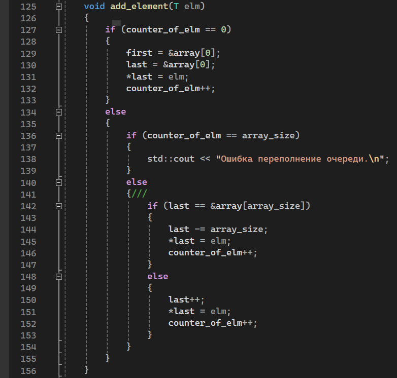||
|очередь на списках|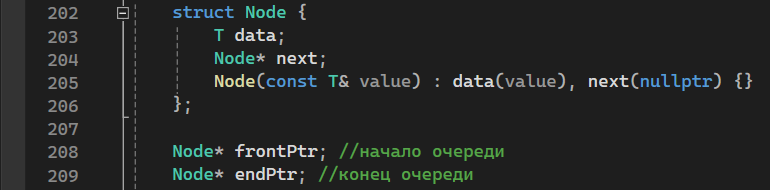|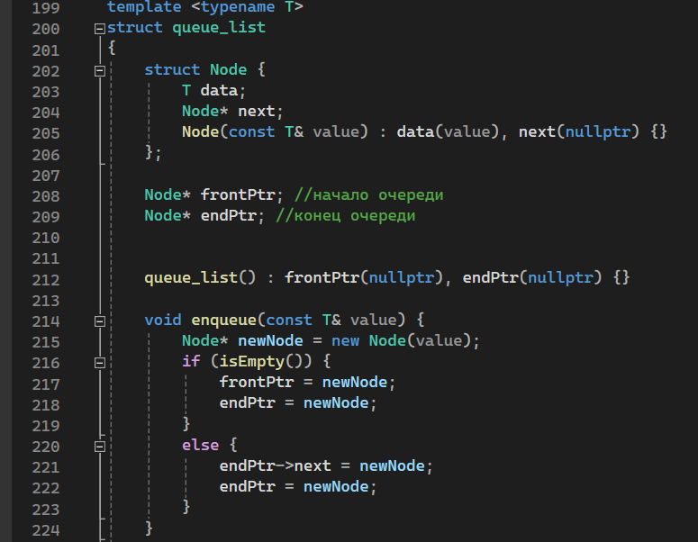|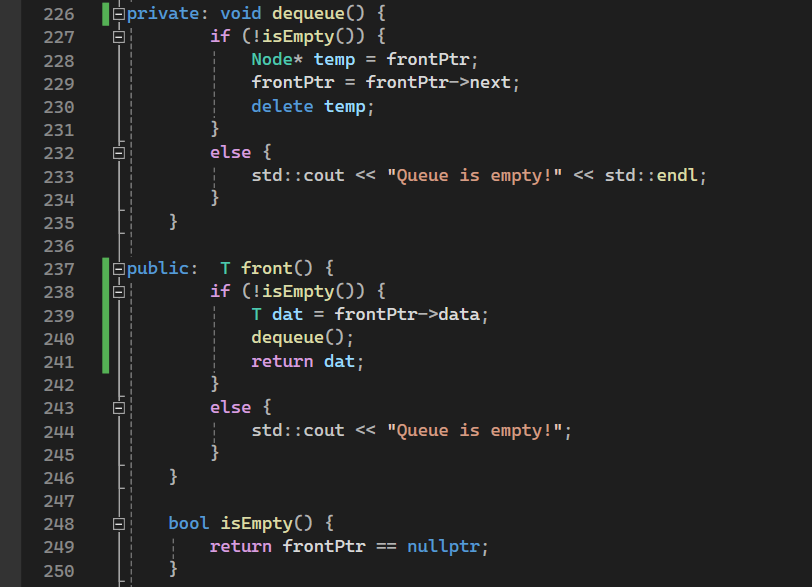|
