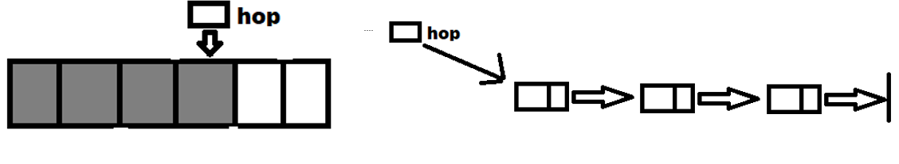

# Алгоритмы тренировка

##Задача: реализовать очередь и стек на массивах и на списках.

Представитм абстракции стека и очереди как структур данных:

## Решение

###Вашему вниманию предлагается графическое представление задачи:

|абстракция|детали абстракции|
|----------|-----------------|
||hop - указатель на последний добавленный элемент|
||hop - указатель на последний добавленный элемент|
||first - указатель на первый вошедший в очередь элемент, last - указатель на последний вошедший элемент|
||first - указатель на первый вошедший в очередь элемент, last - указатель на последний вошедший элемент|
